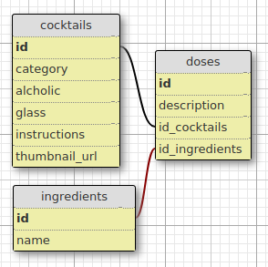

# SOUP OF THE DAY
*RAILS MISTER COCKTAIL PROJECT*

Soup of the Day is a basic online recipe book for cocktails.  There is account required - anyone can create, edit and delete cocktails.

#### RUBY VERSION:

- RUBY: 2.6.5
- RAILS: 5.2.4.1

#### DEPENDENCIES:

-  @RAILS/WEBPACKER: 4.2.2
- JQUERY: ^3.5.1
- POPPER.JS: ^1.16.1
- BOOTSTRAP: ^4.4.1

*DEV DEPENDENCIES*
- WEBPACK-DEV-SERVER: ^3.10.3

#### CONFIGURATION:

N/A

#### DATABASE:

**SCHEMA DESIGN**

**SEED FILE**
- REQUIRES: Faker; Open-URI

1. CLEANS old database
2. CREATES new database w/ 25 random cocktails parsed from **The Cocktail Database API**
    - API fetches a *random* cocktail from The Cocktail DB
        - *if the cocktail does not already exist in the DB, it will be added, else a new cocktail is parsed*
    - API provides: name, category, alcoholic, glass, instructions, ingredients, doses, and thumbnail URL

#### TEST SUITE:

N/A

#### SERVICES:

N/A

#### DEPLOYMENT:

- HEROKU

https://sydneybroccoli-mister-cocktail.herokuapp.com/

---

*LAST UPDATE:* 30 JULY 2020
